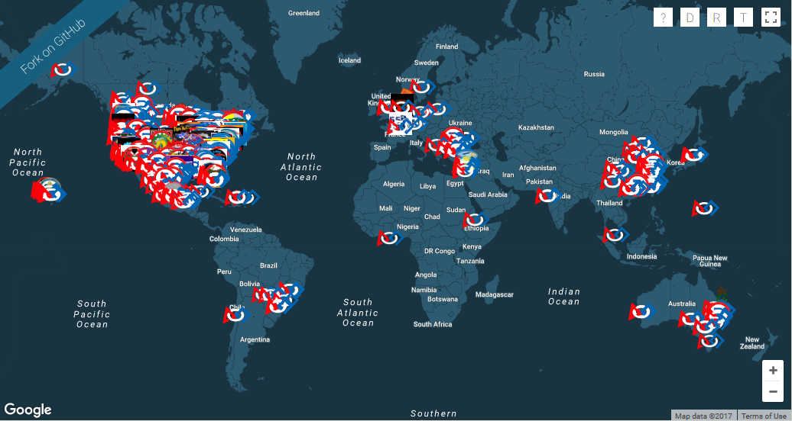

# FIRSTMap
An interactive online map of FRC teams.



# Team Icon Overrides
To modify the image used for your team's marker:
1. Fork the repository.
2. Add an image, titled `{team_number}.png`, where `{team_number}` is your team number, to the `/logos` folder. The image should have a maximum width or height of 40 pixels.
3. Open `data/custom_icons.js` and add your team number to the `icons` array found at the beginning of the file.
4. Push these changes to your fork of FIRSTMap.
5. Open a pull-request with the main FIRSTMap repository to merge your fork back to the origin.
6. Enjoy your custom marker image!

To modify the position of your team's marker to more accurately represent your location:
1. Fork the repository.
2. Open `data/custom_locations.js` and add your team's latitude and longitude to the array found in the file. This data entry should follow the syntax:
```json
"team_number": {
    "lat": latitude,
    "lng": longitude
}
```
3. Push these changes to your fork of FIRSTMap.
4. Open a pull-request with the main FIRSTMap repository to merge your fork back to the origin.
5. Enjoy the updated location of your team's marker!
--------------------------------------------------------------------------------

This software is protected under the MIT License. See `LICENSE` for more information.
