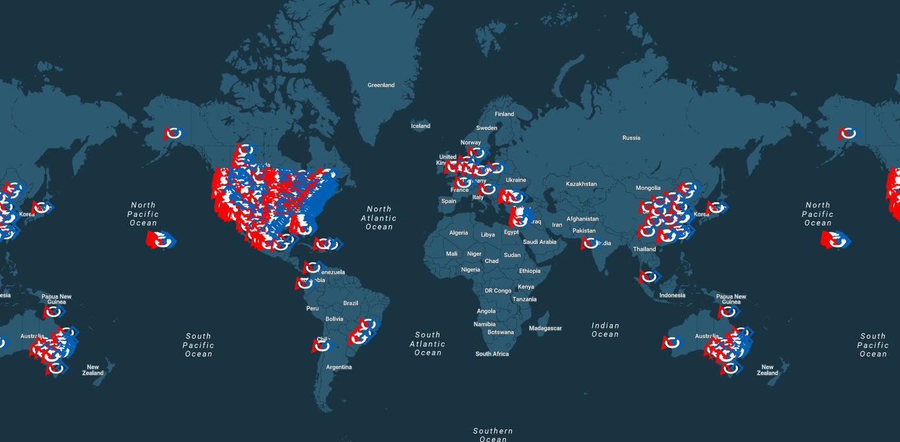

# FIRST Map
An interactive online map of FRC teams.

# Adding your team's logo
1. Fork the repository.
2. Add an image, titled `####.png`, where `####` is your team number, to the `logos` folder. The image should have a maximum width or height of 40 pixels.
3. At the top of `script.js`, add your team number to the `icons` array.
4. Push to your fork and open a pull request from your fork back into the origin.
5. That's it!

--------------------------------------------------------------------------------

This software is protected under the MIT License. See `LICENSE` for more information.
